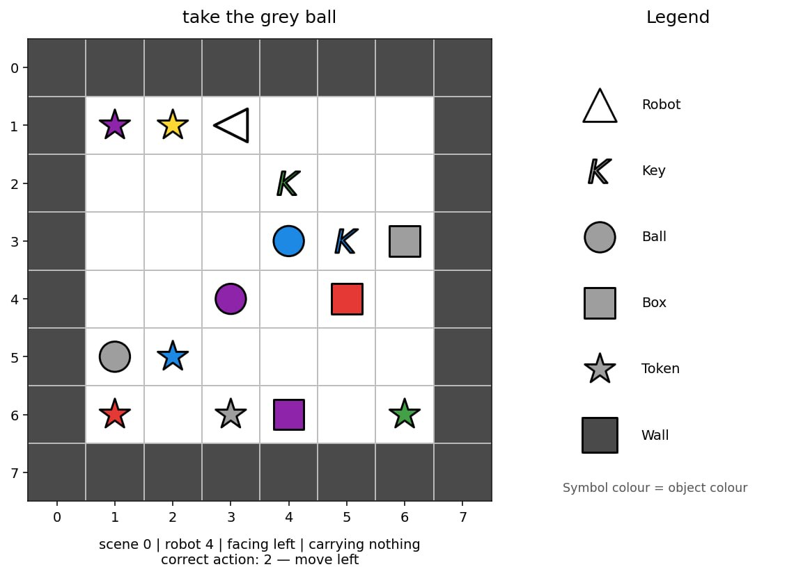

# Ndjekja e Robotëve

- **Kufiri kohor:** 5 minuta
- **Mjedisi:** një GPU (≈16 GB VRAM), pa internet
- **Madhësia e zgjidhjes:** `solution.ipynb` ≤ 1 MB
- **Hapësira ruajtëse:** 5 GB 

## Detyra

Ka gjashtë robotë. Çdo robot vepron në një dhomë të vogël të përfaqësuar nga një tabelë. Çdo dhomë ka një zonë të luajtshme `6×6` të rrethuar me mure, kështu që matrica e plotë `image` ka madhësi `8×8` (zona e luajtshme + muret).

Çdo robot merr një udhëzim në anglisht që përshkruan një detyrë. Pamja e çastit mund të merret në cilëndo pikë ndërsa roboti po e kryen atë. Synimi juaj është të parashikoni veprimin e ardhshëm të robotit.

Robotët nuk ndjekin gjithmonë shtegun më të shkurtër. Roboti 0 mund të sillet ndryshe nga Roboti 1, por çdo robot ndjek modelin e vet konsistent. Përdorni shembujt e trajnimit, të cilët përfshijnë veprimet e sakta të ardhshme, për t'i mësuar këto modele.



Ka tre lloje misionesh:

- **shko te** një objekt, për shembull `"approach the red ball"`;
- **merr** një objekt, për shembull `"grab the blue key"`;
- **vendos një objekt pranë një tjetri**, për shembull
  `"place the red box beside the green ball"`.

I njëjti udhëzim mund të shkruhet në disa mënyra. Bashkësia e testimit mund të përmbajë kombinime të reja frazash, ngjyrash dhe llojesh objektesh. Megjithatë, çdo fjalë, model fraze, ngjyrë, lloj objekti dhe lloj misioni i përdorur në bashkësinë e testimit shfaqet gjithashtu në bashkësinë e trajnimit.

Çdo mostër ka fushat e mëposhtme:

| Fusha | Kuptimi |
|---|---|
| `robot_id` | cili prej 6 robotëve është ky (`0`–`5`) |
| `image` | dhoma, një matricë numrash të plotë `8×8×2` ku kanali 0 përmban object_idx kategorik (p.sh., 1=bosh, 2=mur, 10=robot) dhe kanali 1 përmban colour_idx kategorik (0–5). |
| `direction` | drejtimi nga i cili është kthyer aktualisht roboti |
| `mission` | udhëzimi i dukshëm në gjuhë të natyrshme |
| `carrying` | `null` ose `[object_idx, colour_idx]` për objektin e mbajtur |

Rreshtat janë pamje të çastit të pavarura, në rend të rastësishëm. Ato nuk formojnë episode dhe gjatë vlerësimit nuk është i disponueshëm asnjë vëzhgim ose veprim i mëparshëm.

`visualize_dataset.ipynb` i dhënë ju lejon të inspektoni vëzhgimet që janë në dispozicion të modelit në situata të ndryshme.

## Kodimi i tabelës

`image[row][column] = [object_idx, colour_idx]`. Indeksi i parë është rreshti nga lart poshtë dhe i dyti është kolona nga e majta në të djathtë. Matrica përfshin kufirin e jashtëm prej muri, kështu që pjesa e brendshme ku bëhen lëvizjet është `6×6`.

ID-të e objekteve:

| id | objekti |
|---:|---|
| 1 | qelizë bosh |
| 2 | mur |
| 5 | çelës |
| 6 | top |
| 7 | kuti |
| 10 | robot |
| 11 | token |

Tokenët mund të shfaqen në dhomë, por nuk përmenden kurrë në misione.

ID-të e ngjyrave janë `0` e kuqe, `1` e gjelbër, `2` blu, `3` vjollcë, `4` e verdhë dhe `5` gri. Kanali i ngjyrës nuk ka kuptim për qelizat bosh dhe muret.

Imazhi ka vetëm dy kanalet e mësipërme. Drejtimi i robotit jepet një herë, në fushën e nivelit të sipërm `direction`; ai nuk duplikohet brenda `image`.

## Veprimet

Për kodet `0`–`3`, veprimet e lëvizjes përdorin përputhjen absolute të mëposhtme:

| veprimi | kuptimi |
|---:|---|
| 0 | lëviz lart |
| 1 | lëviz poshtë |
| 2 | lëviz majtas |
| 3 | lëviz djathtas |
| 4 | merr |
| 5 | lësho |


Fusha `direction` tregon orientimin aktual duke përdorur: 0 = Lart (row - 1), 1 = Poshtë (row + 1), 2 = Majtas (col - 1), 3 = Djathtas (col + 1).

Një veprim lëvizjeje fillimisht e kthen robotin në atë drejtim absolut dhe më pas përpiqet ta lëvizë me një qelizë. Një mur ose objekt mund ta bllokojë lëvizjen, por drejtimi gjithsesi ndryshon. `pick up` dhe `drop` veprojnë vetëm mbi qelizën fqinje të synuar, të përcaktuar nga drejtimi (p.sh., nëse direction=0, veprohet mbi (row - 1, col)).

## Dataset

Ju jepen dy folderë:

| Folderi | Rreshtat | `labels.json`? | Përdoreni për të |
|---|---:|---|---|
| `dataset/train/` | 60,000 | të përfshira | trajnuar modelin tuaj |
| `dataset/test_public/` | 3,600 | të përfshira në kopjen e zhvillimit | ekzekutuar dhe vetëvlerësuar pipeline-in tuaj |

Çdo folder përmban `observations.json`, një listë JSON të mostrave të përshkruara
më sipër. `labels.json` është një listë JSON e rreshtuar e veprimeve (`0`–`5`).

Bashkësia e trajnimit përmban saktësisht 10,000 rreshta për robot dhe 20,000 rreshta nga secila
familje detyrash. Testi publik përmban 600 rreshta për robot. Mbështilleni `image` me
`numpy.asarray(...)` nëse ju nevojitet një varg.

Gjatë vlerësimit, `dataset/test_public/` zëvendësohet në mënyrë transparente nga një bashkësi e fshehtë prej
3,600 vëzhgimesh në të njëjtin format, por pa `labels.json`. Tabela publike
e renditjes përdor `test_leaderboard_a`; renditja përfundimtare përdor
`test_leaderboard_b`. Një notebook që lexon pa kushte etiketat e testit do të dështojë.
Lexoni etiketa vetëm nga `dataset/train/`.

## Output

Shkruani `predictions.json` në folderin e punës të notebook-ut. Ai duhet të jetë një listë JSON
që përmban një veprim me numër të plotë (`0`–`5`) për çdo rresht të
`dataset/test_public/observations.json`, në të njëjtën renditje. Për një bashkësi hipotetike testimi që përmban gjashtë mostra, një output i vlefshëm do të ishte:

```json
[0, 3, 2, 2, 5, 4]
```

Një file JSON që mungon ose është i pavlefshëm, një numër i gabuar parashikimesh, një vlerë jo e plotë,
ose një veprim jashtë `{0,1,2,3,4,5}` refuzohet pa pikë.

## Vlerësimi

Vlerësimi është **saktësia mesatare për robot** në një shkallë `0`–`100`. Saktësia fillimisht
llogaritet në mënyrë të pavarur për çdo robot, pastaj merret mesatarja për të gjashtë robotët. Prandaj, çdo
robot ka peshë të barabartë.

## Si të dorëzoni

1. Hapni `solution.ipynb` dhe ekzekutoni të gjitha qelizat.
2. Konfirmoni se ai shkruan `predictions.json` me 3,600 parashikime për bashkësinë publike
   të testimit.
3. Përmirësojeni modelin nëse dëshironi; baseline-i i dhënë demonstron vetëm
   formatin e kërkuar të input dhe output.
4. Në Git tab të JupyterLab, bëni stage dhe commit `solution.ipynb`, pastaj bëni push.
5. Kthehuni në faqen e garës dhe klikoni **Submit**.

Dorëzoni saktësisht një file me emrin `solution.ipynb`.
