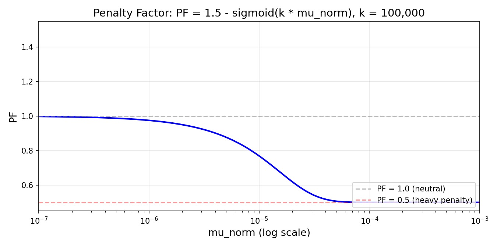

# Dubbelagentens dilemma

- **Tidsgräns:** 12 minuter.
- **Lagring:** 5 GB
- **Miljö:** en GPU (≈16 GB VRAM), ingen internetuppkoppling
- **Lösningens storlek:** `solution.ipynb` ≤ 1 MB
- **Baseline-poäng:** 0 
- **Vetenskapliga kommitténs poäng:** 96.99 

Vid det nationella AI-centret i Astana analyserar två datormodeller — Modell R (en ResNet-18) och Modell V (en ViT-Tiny) — fotografier. Just nu presterar båda modellerna felfritt, med 100 % träffsäkerhet, och de är överens om varenda bild. För att testa hur olika deras smarta "hjärnor" egentligen är ger chefsforskaren dig en utmaning: gör små, nästan osynliga pixelförändringar i varje foto så att Modell R och Modell V blir helt oense.


## 1. Uppgift

Två förtränade bildklassificerare betraktar samma bild. På de bilder som tillhandahålls i denna uppgift presterar båda klassificerarna med 100 % träffsäkerhet.

- **Modell R**: `torchvision.models.resnet18` (ett CNN, ResNet18).
- **Modell V**: `timm`:s `vit_tiny_patch16_224` (en Transformer, ViT-Tiny).

Din uppgift är att skapa en liten förändring ("perturbation") för varje bild så att de två modellerna blir oense. För varje bild måste du skapa **två olika** perturbationer:

- **Typ A**: efter att den lagts till klassificerar Modell R fortfarande bilden korrekt, medan Modell V klassificerar den felaktigt.
- **Typ B**: efter att den lagts till klassificerar Modell V fortfarande bilden korrekt, medan Modell R klassificerar den felaktigt.

Varje perturbation måste vara *liten* nog för att vara svår att lägga märke till. Mindre perturbationer ger högre poäng (se avsnitt 5). Perturbationen appliceras direkt på originalbilden på pixelnivå.

## 2. Publika data

En uppsättning bilder tillhandahålls med uppgiften, organiserad i två splits — `train` (100 bilder) och
`test_public` (100 bilder) — vardera med bilder av varierande upplösning. Alla bilder kommer från ImageNet-1K:s 1000 klasser och både Modell R och Modell V uppnår 100 % träffsäkerhet på båda splits.

Följande filer tillhandahålls:

```text
train/images/*.png         # 100 images in PNG format
train/labels.json          # maps each image index to its correct class
test_public/images/*.png   # 100 images in PNG format
test_public/labels.json    # maps each image index to its correct class
```

Vid rättningstillfället ersätts din mapp `dataset/test_public/` transparent av två dolda bilduppsättningar (`test_leaderboard_a` och `test_leaderboard_b`) för den officiella poängsättningen. Var och en av dem innehåller **100 bilder** i PNG-format och en etikettfil. 

**Observera: I denna uppgift är etiketterna i testdatamängderna tillgängliga.**

## 3. Utdataformat

För varje bild måste du producera två filer:

```text
{index}_a.pt   # Type A perturbation
{index}_b.pt   # Type B perturbation
```

- `{index}` (`0`, `1`, `2`, ...), matchar bildens namn i datamängderna.
- Varje fil är en enskild tensor sparad med `torch.save`. Dess form måste vara `3 x H x W`, där `H` och `W` matchar bildens **ursprungliga** upplösning (inte `224 x 224`).
- Koden ska producera endast en ZIP-fil, `submission.zip`. Placera alla `.pt`-filer på översta nivån i ZIP-arkivet, utan omslutande mapp eller underkataloger. 

```text
submission.zip
├── 0_a.pt
├── 0_b.pt
└── 1_a.pt
└── ...
```

Notebooken varnar dig om det finns några problem med utdataformatet.

## 4. Begränsningar

- **Modeller:** Du måste använda `torchvision.models.resnet18(pretrained=True)` och `timm.create_model('vit_tiny_patch16_224', pretrained=True)`. Inga andra förtränade modeller är tillåtna.
- **Transform-pipeline (påtvingad vid utvärdering):** `Resize(256) → CenterCrop(224) →
  Normalize(mean=[0.485,0.456,0.406], std=[0.229,0.224,0.225])`. See Section 3 of `baseline.ipynb` för detaljer. 
- **Perturbationens upplösning:** Måste matcha bildens **ursprungliga** råa upplösning (inte 224×224). Tensorn
  adderas till råbilden *före* transform-pipelinen.
- **Utdataformat:** Endast `.pt`-filer — ingen PNG/JPG. Tensorerna adderas till råbilden och pixelvärdena klipps till `[0, 1]` före förbehandlingen.
- **Filnamngivning:** Platt listade, strikt format `{index}_a.pt` / `{index}_b.pt`. Inga underkataloger inuti zip-filen.
- **Bibliotek:** `torch`, `torchvision`, `timm`. 

## 5. Poängsättning

Slutpoängen beräknas enligt följande. Låt `M` vara antalet bilder i splitten, $Score_A$ antalet lyckade perturbationer av Typ A, och $Score_B$ antalet lyckade perturbationer av Typ B:
$$
S_{final} = \frac{Score_A + Score_B}{2M} \times PF
$$

PF är en funktion utformad för att bestraffa perturbationer med hög norm och för att vara mycket känslig nära prestandataket. Den är begränsad till intervallet 0.5 till 1. Den fullständiga implementationen kan ses i avsnitt 8 i `solution.ipynb`. 


Figur: Kurvan för straffunktionen.

## 6. Kontrollera inlämningen

Det finns kontroller i notebooken som varnar dig om det finns formateringsproblem, i avsnitt 7 i notebooken `solution.ipynb`.

## 7. Lokal testning

`solution.ipynb` innehåller ett komplett, fungerande exempel. Den laddar in publika data, båda modellerna och den officiella poängsättaren, samt skriver en ZIP-fil för inlämning. Läs den innan du börjar.

## 8. Hur du lämnar in

- Spara dina ändringar i `solution.ipynb`.
- Öppna Git-fliken i JupyterLabs vänstra sidofält.
- **Stage:a** `solution.ipynb` (+-ikonen bredvid den).
- Ange ett commit-meddelande och klicka på **Commit**.
- Klicka på molnet med uppåtpil för att pusha.
- Återvänd till denna Contest-sida och klicka på **Submit**.

Lämna in exakt en fil, med namnet `solution.ipynb`.
