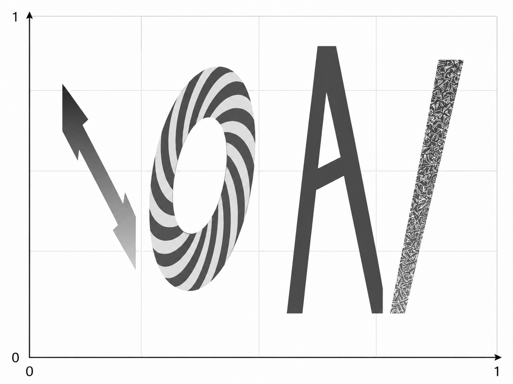
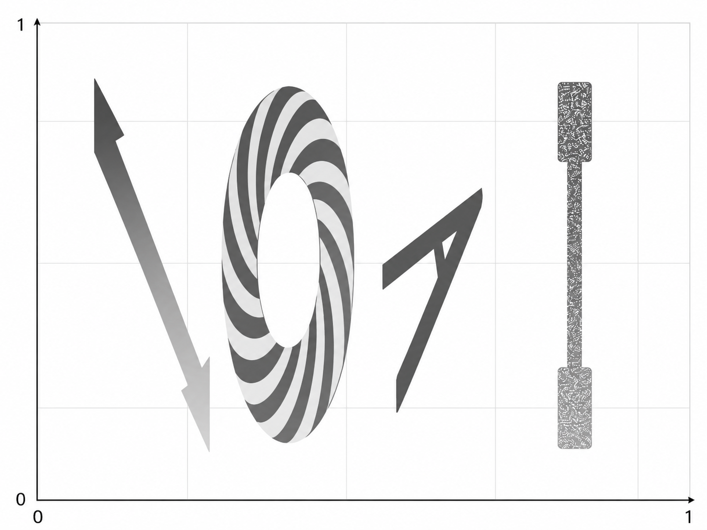
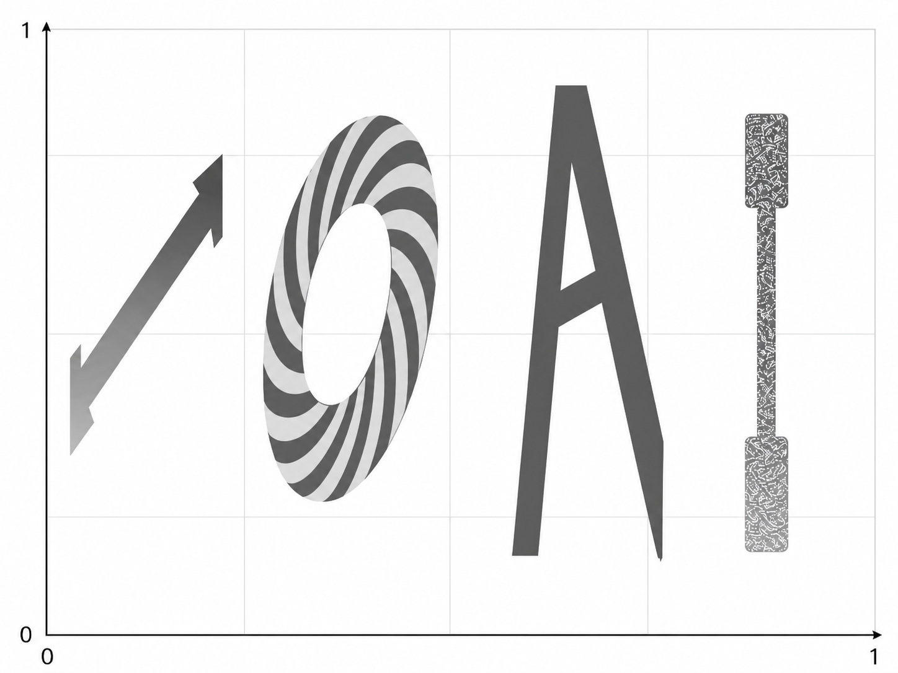

# IOAI поље

- **Временско ограничење:** 5 минута
- **Складишни простор:** 5 GB
- **Величина решења:** `solution.ipynb`, `custom_model.py` ≤ 1 MB заједно
- **Унапред обучени модели:** нису дозвољени — обучавање од почетка, без интернета у време оцењивања
- **Baseline резултат**: 31.2187
- **Резултат Научног комитета:** 63.53

## Задатак

Градоначелник Астане жели да украси град стилизованим IOAI логотипима. Као статистичар, он све — укључујући и логотип — посматра као просторну функцију $F(x, y, \overline{W})$, где $x, y \in [0, 1]$ представљају координате у 2D равни, а $\overline{W}$ је скуп скривених параметара који дефинишу стилске атрибуте као што су боје и углови слова.

Пошто је $F$ сувише сложена да би се изразила као експлицитна математичка једначина, ваш задатак је да обучите неуронску мрежу која ће је апроксимирати. Мрежа ће за сваки пар координата $(x, y)$ давати вредност **IOAI поља**, чиме ће генерисати потпуну визуелизацију логотипа у облику топлотне мапе преко целе равни. Ово је пример визуелизације $F$ у облику топлотне мапе са неким конкретним скривеним параметрима $\overline{W}$.

Од чега се састоји IOAI поље? Од четири слова и позадине.

- Вредности унутар првог слова `I` веома су велике (1e+10 и више), са линеарним градијентом
- Вредности у слову `O` образују спирални образац
- Вредност унутар слова `A` увек је -1
- Вредности унутар последњег слова `I` треба да буду насумичне вредности из опсега $[-2026,2026]$, чак и ако се у истој тачки израчунају два пута
- Изван слова вредност је увек нула

Функција има скривене параметре $\overline{W}$, који утичу на размеру и нагиб слова, као и на опсег вредности унутар првог слова `I`. Међутим, слова се неће пресецати. Ево неколико илустративних примера како IOAI поље изгледа са различитим $\overline{W}$:

**Шта вам је дато:**

Овај задатак НЕ садржи скупове података. Уместо тога, дата вам је генераторска функција која се конфигурише помоћу JSON конфигурационе датотеке на путањи `data/train_config/field_config.json`. 

Тест конфигурација је скривена, али је сличне природе. Ваш задатак је да прилагодите модел датом генератору користећи онолико података колико желите. Ваше дистрибуције за „обучавање“ и „тестирање“ генеришу се из истог генератора — само не знате у којим тачкама $(x_i, y_i)$ ћете бити оцењивани.

Ваше решење треба да се састоји од:
- класе модела за обучавање сачуване као `custom_model.py`. Овај модел треба да наслеђује класу `torch.nn.Module` и користи само `torch` увозе. Треба да садржи класу `CustomModel` која се користи у свесци `solution.ipynb`. 
- свеске `solution.ipynb`, која ће произвести тежине `model.pt`

## Бодовање

За сваку област, најмањи резултат је 0, а највећи резултат је 1. Коначни резултат је просек резултата за свих пет области (четири за свако слово и једна за позадину), помножен са 100. Постоји **пенализација на основу броја параметара:**

**Ако ваш модел има више од 20260 параметара, резултат се преполовљава.**

Број параметара мери се помоћу `sum(p.numel() for p in model.parameters())`. Очекујемо да ваш модел ради и у стохастичком режиму, при чему је PyTorch `nn.Dropout` део модела.

### За стандардне области

За сваку област $R$ (прво слово `I`, `O`, `A`, `Background`), модел оцењујемо на $N_R = 512$ тест тачака $(x_i, y_i)$ са тачним вредностима $v_i$ и предвиђањима $\hat{v}_i$. Као главну метрику користимо нормализовану средњу апсолутну грешку (MAE). MAE се дефинише као:

$$
\mathrm{MAE}(R) = \frac{1}{N_R} \sum_{i=1}^{N_R} |\hat{v}_i - v_i|.
$$

А нормализација се врши као 

$$
\mathrm{score}(R) = 1 - \min\left(\frac{\mathrm{MAE}(R)}{s_R}, 1\right),
$$

где је $s_R > 0$ константа скалирања.

### За област последњег слова `I`

У овој области, **dropout је омогућен током оцењивања**. За сваку тест тачку $j$:

1. Модел покрећемо $K = 10$ пута да бисмо добили $\hat{v}_{j,1}, \ldots, \hat{v}_{j,K}$.
2. Ако је било који излаз изван опсега $[-2026, 2026]$, онда $\mathrm{pointScore}(j) = 0$.
3. У супротном, израчунавамо стандардну девијацију $\sigma_j$ за $K$ излаза и претварамо је у резултат:

$$
\mathrm{pointScore}(j) = \min\left(\frac{\sigma_j}{s_E}, 1\right),
$$

где је $s_E > 0$ фиксна константа скалирања.

Резултат области је просек за све тачке у области:

$$
\mathrm{score}(I_{last}) = \frac{1}{N_E} \sum_{j=1}^{N_E} \mathrm{pointScore}(j),
$$

где $N_E = K * N_R$. 

Једноставно речено, што је разноврсност већа, то ће ваш резултат за ову област бити већи. **Не можете користити случајност у чистом облику, укључујући PyTorch функције `rand*` и `_uniform`; случајност треба да потиче од инференције са омогућеним dropout-ом.**

## Како предати решење

1. Отворите `solution.ipynb` и покрените све ћелије.
2. Побољшајте модел `CustomModel` у `custom_model.py`
3. Уверите се да последња ћелија чува ваш модел у датотеку `model.pt`.
4. У Git картици у JupyterLab-у, додајте `solution.ipynb` и `custom_model.py` у staging, унесите коментар и извршите commit, а затим их push-ујте.
5. Вратите се на страницу такмичења и кликните на **Submit**. Коментар при предаји треба да буде исти као коментар из претходног корака.
